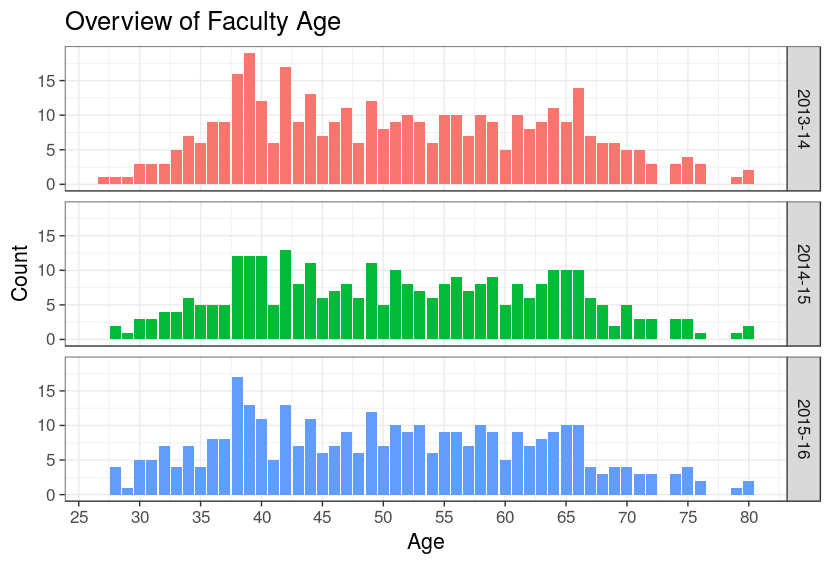
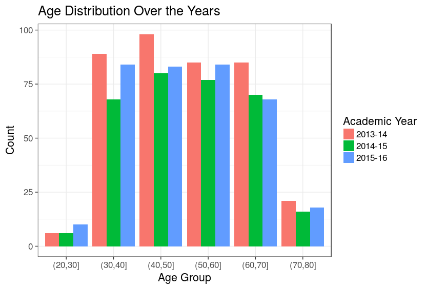
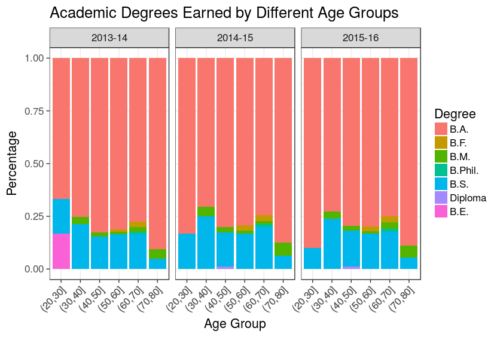
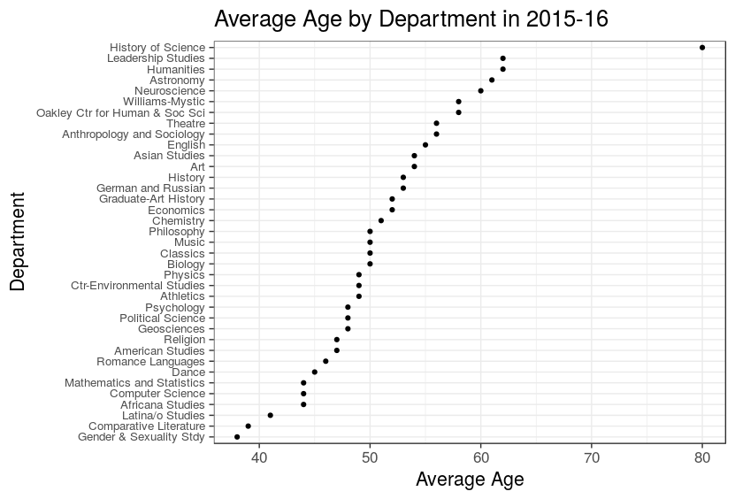

# williams-faculty-age

This package is focused on gathering the graduation data of Williams College faculty in order to estimate the faculty age. It contains several functions that are used to parse online catalogs, scrape data that contains academic background of faculty members from the web and extract names/departments from the collected data. The outline of the complete methodology and the step-by-step walkthrough can be found in the package vignette.

The main problem this package is able to solve is the following. A brief academic history of faculty members is availabe in the course catalogs; however, (1) the format is not consistent throughout years, and (2) data are missing in some catalogs. Consider the following excerpts, taken from the catalogs for the academic years '09-'10, '13-'14 and '15-'16, respectively:

> Colin C. Adams, Thomas T. Read Professor of Mathematics  
> B.S. (1978) M.I.T.; Ph.D. (1983) University of Wisconsin

> Colin C. Adams, Thomas T. Read Professor of Mathematics, 1978, BS, MA Institute of Technology, 1983, PHD, University of WI, Madison

> Adams,Colin C., Mathematics and Statistics 

We solve the former issue by using regular expressions and the latter by running queries on the Williams College online directory and thereby retrieving the missing data.

## Motivation

The motivation of this package is to be able to answer questions such as 
- What is the average age of Williams College faculty?
- How are factors such as like department, gender or terminal degree associated with the estimated age?
- How has the age distribution of professors changed over time?

so on and so forth.

## Getting Started

Follow these R instructions to get a copy of this project on your machine.

```
library(devtools)
install_github("zcesur/williams-faculty-age”)
```

## Results






## Acknowledgments

This project and the questions posed in [Motivation](#motivation) was assigned to me as a summer internship project by my former boss.
